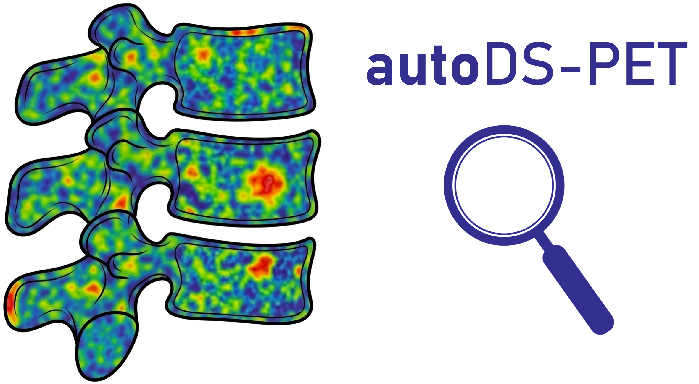
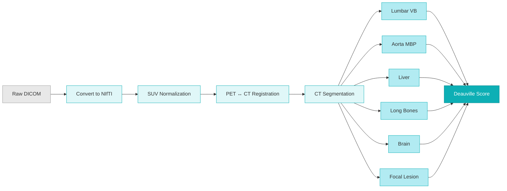

<div align="center">



# autoDS-PET

**Automated Deauville Score computation from PET/CT images**

[](https://www.python.org)
[](LICENSE)
[](https://github.com/Sara-Peluso/autoDS-PET/actions)
[](https://codecov.io/github/Sara-Peluso/autoDS-PET)
[](https://autods-pet.readthedocs.io/)

</div>

autoDS-PET extracts reference uptake values from anatomical ROIs (bone marrow, mediastinal blood pool, liver, long bones, brain, focal lesions) on SUV-normalized PET and assigns Deauville Scores by comparing target uptake against standard thresholds.

## Pipeline



## Features

- **SUV normalization** - Converts raw PET (Bq/mL) to SUVbw with automatic decay correction
- **Rigid registration** - Aligns PET onto the CT grid via SimpleElastix
- **Anatomical segmentation** - Whole-body CT segmentation with TotalSegmentator
- **ROI extraction** - Automated refinement of 6 anatomical ROIs with configurable erosion, morphology, and statistics
- **Deauville scoring** - Assigns DS 1-5 per target by comparing uptake against MBP and liver references
- **Batch processing** - Process entire patient cohorts with progress tracking and CSV/XLSX export

## Installation

```bash
# Core install
pip install autods-pet

# With DICOM SEG support (adds highdicom)
pip install "autods-pet[dicom-seg]"

# With development tools (pytest, pytest-cov, hypothesis)
pip install "autods-pet[dev]"

# Everything
pip install "autods-pet[all]"
```

The **DICOM SEG** extra installs [highdicom](https://github.com/ImagingDataCommons/highdicom),
which enables reading `.dcm` segmentation objects produced by tools like
3D Slicer, OHIF Viewer, dcmqi, Kaapana, and MONAILabel. Without this extra,
NIfTI (`.nii`, `.nii.gz`) and NRRD (`.nrrd`) masks are still fully supported.

> [!NOTE]
> **External tools required:**
> - [TotalSegmentator](https://github.com/wasserth/TotalSegmentator) for CT segmentation
> - Elastix / SimpleElastix for PET-to-CT registration

## Quick Start

### CLI

```bash
# Generate a config template
autods-pet create-config --output my_config.ini

# Full pipeline - single patient
autods-pet run -c my_config.ini -p PATIENT_001

# Full pipeline - batch with Excel output
autods-pet run -c my_config.ini --format xlsx

# Force re-run (ignore cached results)
autods-pet run -c my_config.ini --force

# Individual steps (each supports --force)
autods-pet convert   -c my_config.ini
autods-pet normalize -c my_config.ini
autods-pet register  -c my_config.ini
autods-pet segment   -c my_config.ini
autods-pet extract   -c my_config.ini
autods-pet score     -c my_config.ini -p PATIENT_001,PATIENT_002
```

### Python API

```python
from autods_pet import DeauvillePipeline, load_config

cfg = load_config("my_config.ini")
pipeline = DeauvillePipeline(cfg)

# Single patient
result = pipeline.run("PATIENT_001")
print(result.scores)  # {"BM_DS": 3, "LB_DS": 2, "FL_DS": 4, ...}

# Force re-run (ignore cached results)
pipeline = DeauvillePipeline(cfg, force=True)
result = pipeline.run("PATIENT_001")
```

> [!TIP]
> All public symbols are re-exported from the top-level `autods_pet` package.
> You can also import from submodules directly:
> ```python
> from autods_pet.imaging.normalization import compute_suvbw
> from autods_pet.deauville import assign_ds
> from autods_pet.roi.liver import LiverROI
> ```

<details>
<summary><strong>Input data layout</strong></summary>

Source data lives under `basepath`, one sub-folder per patient:
```
basepath/
  PATIENT_001/
    *.dcm                           # DICOM files (flat or nested)
    lesion.nii                      # (optional) Focal lesion mask
    paramedullary.nii               # (optional) Paramedullary mask
    extramedullary.nii              # (optional) Extramedullary mask
  PATIENT_002/
    CT.nii.gz                       # Pre-converted NIfTI also supported
    PET.nii.gz
```

</details>

<details>
<summary><strong>Supported segmentation mask formats</strong></summary>

Target masks (focal lesion, paramedullary, extramedullary, custom) can be
provided in any of these formats:

| Format | Extensions |
|---|---|
| NIfTI | `.nii.gz`, `.nii` |
| NRRD | `.nrrd` |
| DICOM SEG | `.dcm` (requires `pip install autods-pet[dicom-seg]`) |

**Mask discovery is recursive**: drop the file (or DICOM SEG export) anywhere
under the patient input directory, including nested study/series sub-folders
exported by a DICOM viewer. Each target section may set:

- `mask_filename` - stem(s) for `.nii.gz` / `.nii` / `.nrrd` files (single
  stem or comma list).
- `segment_label` - `SegmentLabel`(s) inside a DICOM SEG (single value or
  comma list, case-insensitive). The SEG file is identified by matching
  its `ReferencedSeriesSequence` to the patient's PET `SeriesInstanceUID`,
  so **filename and folder location are irrelevant**. A single
  multi-segment SEG file can supply several targets at once.

```ini
# Mixed example: NIfTI fallback + DICOM SEG label match.
[focal_lesion]
mask_filename = focal_lesion       ; matches focal_lesion.nii.gz/.nii/.nrrd
segment_label = Focal lesion, FL   ; matches segments labeled "Focal lesion" or "FL"
stats = max, p90

[paramedullary]
segment_label = PM, Paramedullary  ; DICOM SEG only
stats = max, p90
```

When both formats resolve the same target for the same patient, **DICOM SEG
wins** and a note is logged. A configured target whose mask cannot be found
anywhere produces a loud warning naming the patient and the locations
searched - it is never silently dropped.

Use `--explain-masks` on `extract` / `score` / `run` (or
`autods-pet validate-config <cfg> --patients <ids>`) to print a discovery
preview before running.

List the segments inside a DICOM SEG with:

```bash
autods-pet list-segments path/to/segmentation.dcm
```

See [docs/supported_formats.md](docs/supported_formats.md) for details on
format comparison, producing tools, and conversion tips.

</details>

<details>
<summary><strong>Output structure</strong></summary>

All outputs go to `output_dir`, organized per patient:
```
output_dir/
  PATIENT_001_results/
    images/
      CT.nii.gz                     # Converted CT
      PET.nii.gz                    # Converted PET
      PET_SUV.nii.gz                # SUV body-weight normalized
      PET_SUV_reg.nii.gz            # Registered to CT grid
    segmentations/
      TotSeg_multilabel.nii.gz      # TotalSegmentator multilabel
      vertebral_body.nii.gz         # Vertebral body (requires license)
      refined/                      # Post-processed ROI masks
        aorta_mbp.nii.gz
        grey_matter.nii.gz
        liver.nii.gz
        long_bones.nii.gz
        lumbar_vb.nii.gz
    metadata/
      PET_metadata.json             # DICOM tags
      elastix_transform.txt         # Registration parameters
    DeauvilleScores/
      deauville_scores.csv          # Per-patient DS
    SUV/
      SUV_values.csv                # Per-patient SUV stats
  batch_results_DS.csv              # All patients DS summary
  batch_results_SUV.csv             # All patients SUV summary
  batch_errors.csv                  # Errors (only if any)
  manifest.json                     # Run metadata
```

Completed stages are automatically skipped on re-run. Use `--force` to re-run everything.

</details>

<details>
<summary><strong>Deauville Score naming</strong></summary>

| Score | Full name | Reference ROI |
|-------|-----------|---------------|
| `BM_DS` | Bone Marrow DS | Lumbar vertebral bodies (L3-L5) |
| `LB_DS` | Long Bones DS | Femur + humerus diaphysis |
| `FL_DS` | Focal Lesion DS | User-provided lesion mask |
| `PM_DS` | Paramedullary DS | User-provided mask |
| `EM_DS` | Extramedullary DS | User-provided mask |
| `BLR` | Brain-to-Liver Ratio | Brain cortical grey matter / liver (not a Deauville Score) |

</details>

## Documentation

Full documentation is available at **[autods-pet.readthedocs.io](https://autods-pet.readthedocs.io/)**:

- [Getting Started](https://autods-pet.readthedocs.io/en/latest/getting-started.html) - Installation and first run
- [CLI Reference](https://autods-pet.readthedocs.io/en/latest/cli.html) - All commands and options
- [Configuration](https://autods-pet.readthedocs.io/en/latest/configuration.html) - INI file parameters
- [Methodology](https://autods-pet.readthedocs.io/en/latest/methods.html) - Scientific methods description
- [API Reference](https://autods-pet.readthedocs.io/en/latest/api/index.html) - Full Python API

## Notes

> [!IMPORTANT]
> **Intended use:** autoDS-PET is a research software project developed for retrospective data analysis and experimenting with 18F-FDG-PET/CT image analysis. 
> The software is provided for research and educational purposes only. It is not intended for clinical use or clinical decision-making.

## Citation

_Available soon._

```bibtex
@article{
}
```

## Changelog

See the full history of changes in the [CHANGELOG.md](CHANGELOG.md) file.

## Acknowledgments

### TotalSegmentator

autoDS-PET relies on [TotalSegmentator](https://github.com/wasserth/TotalSegmentator) for whole-body CT segmentation. Some features (e.g., vertebral body segmentation) require a free non-commercial license obtainable from the TotalSegmentator project.

If you use autoDS-PET in your research, please also cite TotalSegmentator:

> Wasserthal J, Breit HC, Meyer MT, et al. TotalSegmentator: Robust Segmentation of 104 Anatomic Structures in CT Images. *Radiology: Artificial Intelligence.* 2023;5(5):e230024.

TotalSegmentator is distributed under the [Apache License 2.0](https://www.apache.org/licenses/LICENSE-2.0).

## License

MIT - Sara Peluso

Third-party dependencies are subject to their own licenses. In particular, TotalSegmentator is licensed under the Apache License 2.0.
